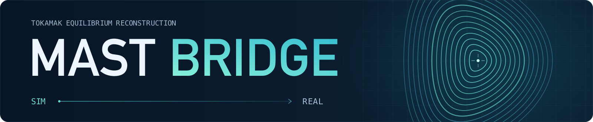
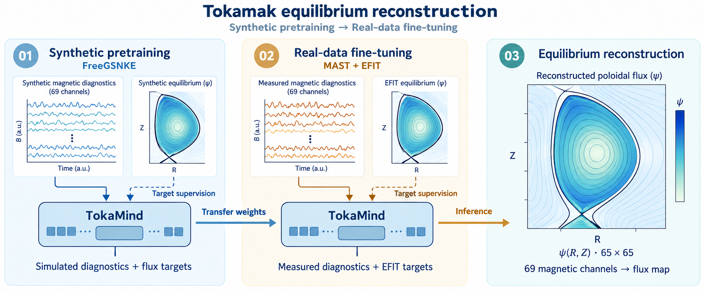

# 

Learn in simulation, reconstruct real tokamak equilibria.



## Experiments

The experiments compare training on real data from scratch with synthetic
pretraining followed by fine-tuning, using 1–100% of the real training data.

| Study | Evaluation setting |
|---|---|
| Random split | Random partition of shots into training, validation, and test sets |
| Temporal split | Training on earlier campaigns and testing on a later campaign |
| Shape-OOD | Generalization to held-out diverted plasma geometries |

## Installation

Use Python 3.10–3.13. From the repository root:

```bash
python -m venv .venv
source .venv/bin/activate
mkdir -p ../external
git clone https://github.com/UKAEA-IBM-STFC-Fusion-FMs/tokamind.git ../external/tokamind
git -C ../external/tokamind checkout 0b67cf56cd945b883fd3b0c9050cdfc560f98533
python -m pip install -e . -e ../external/tokamind numpy zarr
```

The pinned TokaMind revision supplies the `mmt` package used for training and
evaluation. Synthetic equilibrium generation additionally requires FreeGSNKE
and MAST machine geometry inputs.

## Evaluation

Real MAST data are sourced from FAIR-MAST. Evaluation requires a trained model,
normalization scalers, and a test manifest with local data paths or a matching cache.

With the model and test data prepared:

```bash
python scripts/evaluate_tokamind_testset.py \
  --manifest /path/to/test_manifest.jsonl \
  --run-dir /path/to/model_run \
  --output-json outputs/result.json
```

The output reports reconstruction errors for the poloidal flux field.

## References

- [TokaMind](https://github.com/UKAEA-IBM-STFC-Fusion-FMs/tokamind) — transformer model and training framework.
- [FreeGSNKE](https://github.com/FusionComputingLab/freegsnke) — free-boundary tokamak equilibrium solver.
